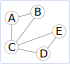
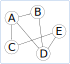
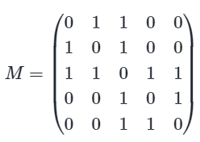

Les graphes
============

.. admonition:: Définitions
    :class: definition

    #.  Un **graphe** ``G=(S,A)`` est un ensemble ``S`` de **sommets** reliés par l'ensemble ``A`` des **arcs** ou des **arêtes**.
    #.  Deux sommets reliés par un arc sont **adjacents**.
    #.  Lorsque les arcs sont munis d’un **sens** de parcours, on dit que le graphe est **orienté**.
    #.  Lorsque les arcs sont munis d’un **poids** (valeur numérique), on dit que le graphe est **pondéré**.

La figure ci-dessous représente un **graphe** ``G``.

Ce graphe contient 5 sommets ``A, B, C, D, E`` reliés par 6 arcs ou arêtes.

Le sommet ``A`` est relié aux sommets ``B`` et ``C``. Le sommet ``A`` est donc **adjacent** aux sommets ``B`` et
``C``.

Un autre exemple de graphe ``G`` qui est **orienté**.

Les arêtes ou arcs ont un sens de parcours entre les sommets symbolisés par des flèches.

Matrice d’adjacence
---------------------

.. admonition:: Définition
    :class: definition

    Soit ``G`` un graphe possédant ``n`` sommets. La **matrice d'adjacence** d'un graphe ``G`` est un tableau carré de dimension ``n`` où:

    -   Chaque ligne et chaque colonne représente un sommet;
    -   Si deux sommets sont adjacents, la valeur à l'intersection de la ligne et de la colonne représentant les 2 sommets est égale à 1; 
    -   Lorsque les sommets ne sont pas adjacents, la valeur à l'intersection de la ligne et de la colonne représentant les 2 sommets est égale à 0; 
    -   La matrice est notée entre 2 parenthèses englobant toutes les lignes.

    Si le graphe n’est pas orienté, la matrice est symétrique par rapport à sa diagonale.

On remprend le premier graphe ``G`` donné en exemple:

Ce graphe ``G`` admet la matrice d'adjacence suivante:

-   La matrice est de dimension :math:`5` puisque le graphe a 5 sommets;
-   La première ligne et la première colonne de la matrice représente le sommet ``A``;
-   La seconde ligne et la seconde colonne de la matrice représente le sommet ``B``;
-   Les sommets ``A`` et ``B`` sont adjacents: la valeur à l'intersection de la première ligne et de la deuxième colonne est égale à 1.
-   Le graphe n'est pas orienté donc la matrice est symétrique par rapport à la diagonale. En conséquence, la valeur à l'intersection de la deuxième ligne et de la première colonne est égale à 1.

Liste d'adjacence
------------------

.. admonition:: Définition
    :class: definition

    Un graphe ``G`` peut être décrit par l'ensemble de ses sommets adjacents. Pour chacun de ces sommets, on lui associe la liste des sommets qui lui sont adjacents.

Pour le graphe ``G`` redonné ci-dessous:

La liste d'adjacence de ce graphe est :

.. code-block:: Python

    A : [B,C]
    B : [A,C]
    C : [A,B,D,E]
    D : [C,E]
    E : [C,D]

Interface d’un graphe
----------------------

.. admonition:: Propriété
    :class: propriete

    L'interface d'un graphe doit définir celui-ci avec :

    -   sa matrice d'adjacence avec des valeurs booléennes ``True`` et ``False`` ou entières ``1`` et ``0``.
    -   sa liste d'adjacence contenant pour chaque sommet sa liste de ses sommets adjacents.

    L'interface du graphe doit proposer plusieurs primitives qui permettent d'accéder aux éléments du graphe. On peut retrouver les fonctions ou méthodes suivantes :

    -   vérifier si un sommet appartient au graphe;
    -   vérifier si arc entre 2 sommets existe;
    -   renvoyer la liste des sommets adjacents à un sommet du graphe;
    -   renvoyer le nombre de sommets du graphe;
    -   renvoyer le nombre d’arcs du graphe;

    D'autres méthodes ou fonctions peuvent compléter les primitives précédentes comme :

    -   ajouter un sommet au graphe ;
    -   ajouter un arc entre 2 sommets d'un graphe;
    -   supprimer un sommet au graphe; 
    -   supprimer un arc entre 2 sommets du graphe;

Implémentation en Python
--------------------------

Plusieurs implémentations en Python sont possibles. 

#.  L'implémentation de la matrice d'adjacence d'un graphe peut simplement se réaliser avec une liste Python à 2 dimensions. C'est donc une liste qui contient autant de listes que de sommets. Chaque sous-liste représente alors une ligne de la matrice d'ajacence.

#.   L'implémentation de la liste d'adjacence d'un graphe peut se réaliser avec un dictionnaire. Chaque clé du dictionnaire représente un sommet du graphe. Les valeurs associées aux clés du dictionnaire sont des listes contenant les sommets adjacents.

#.   Les primitives définies par l'interface du graphe sont codées sous formes de fonctions.

.. note::

    La création d'une classe ``Graphe`` pour implémenter un graphe est possible. La matrice d'adjacence et la liste d'adjacence du graphe sont les attributs de l'objet construit ``Graphe`` et les primitives sont les méthodes de la classe.