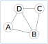
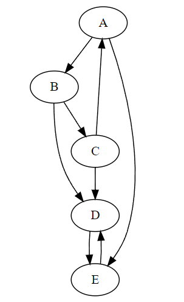

exercices en Python
===================

.. note::

    Les exercices suivants proposent une implémentation en Python d'une interface de Graphe. Cette implémentation et l'interface proposée ne sont que des cas possibles parmi d'autres.

    Il faut envisager des interfaces et des implémentations différentes.

Exercice 1
-----------

On définit un graphe par sa matrice d'ajacence. Les primitives suivantes définissent l'interface de ce graphe:

    -   Le constructeur ``creer_matrice`` a pour paramètre ``n`` de type entier correspondant à la dimension de la matrice, c'est à dire au nombre de sommets du graphe. La fonction renvoie une liste de dimension ``n`` contenant ``n`` listes de dimension ``n`` initialisée à 0.
    -   La fonction ``est_adjacent`` a pour paramètres la matrice d'adjacence et 2 sommets du graphe ``i`` et ``j`` de type entiers. La fonction renvoie un booléen de valeur ``True`` si les sommets sont adjacents et de valeur ``False`` s'ils ne le sont pas.
    -   La fonction ``ajouter_arc`` a pour paramètres la matrice d'adjacence et ``i`` et ``j`` de type entiers associés à 2 sommets du graphe. La fonction ajoute un arc entre les 2 sommets ce qui signifie que les sommets sont adjacents. La fonction ne renvoie rien.
    -   La fonction ``supprimer_arc`` a pour paramètres la matrice d'adjacence et ``i`` et ``j`` de type entiers associés à 2 sommets du graphe. La fonction supprime un arc entre les 2 sommets ce qui signifie que les sommets ne sont pas adjacents. La fonction ne renvoie rien.

Un graphe ``G`` est donné ci-après nous permettre de tester nos fonctions.

#.  Implémenter cette interface par des fonctions en Python. 
#.  Soit ``M`` la variable associée à la matrice d'adjacence du graphe ``G``.

    a.  Écrire une instruction qui crée la variable ``M`` contenant une matrice initialisée avec des valeurs nulles.
    b.  Écrire les instructions Python qui représente la matrice d'adjacence du graphe ``G``.
#.  Le module ``Graphviz`` (disponible sur Capytale) affiche des graphes définis par des objets de la classe ``Graph`` dont ``dot`` et ``edge`` sont des attributs. Le module doit être importé pour être utilisé.

    from graphviz import Graph

    La fonction ``afficher`` prend en paramètre une matrice d'adjacence d'un graphe non orienté et en donne une représentation sous forme d'image ``png``.

    .. code-block:: python

        def afficher(matrice):
            """
            Le module Graphviz est utilisé. Les sous-modules Digraph et Graphe
            sont importés.
            La fonction crée un graphe pour être affiché (image format 'png')
            Le graphe est non orienté !
            - on crée les sommets 0->A chr(65), 1->B chr(66), 2->C chr(67),etc.
            - on crée les arcs entre les sommets adjacents
            La fonction renvoie un objet 'dot' qui contient le graphe à afficher
            """
            dot=Graph(format='png')
            n = len(matrice)
            # on crée les sommets du graphe
            for i in range(n):
                dot.node(str(chr(65+i)))
            # on crée les arcs entre les sommets
            for i in range(n):
                for j in range(i,n):
                    if est_adjacent(matrice,i,j):
                        dot.edge(str(chr(65+i)),str(chr(65+j)))
            return dot

    On définit un graphe ``G`` de la façon suivante où ``M`` est la matrice d'adjacence:

    >>> G = afficher(M)
    >>> G.view()

    Ce qui donne une représentation comme la figure ci-dessous:
    
    .. figure:: ../img/graphe_ex_1.png
        :align: center

Exercice 2
----------

On définit un graphe par sa liste d'ajacence qui contient chaque sommet du graphe et pour chaque sommet, la liste des sommets qui lui sont adjacents. Les sommets sont de type string (chaine de caractère). Les primitives suivantes définissent l'interface de ce graphe:

    -   Le constructeur ``creer_liste`` n'a pas de paramètre et renvoie un dictionnaire vide.
    -   La fonction ``est_adjacent`` a pour paramètres la liste d'adjacence et 2 sommets ``s1`` et ``s2`` de type string. La fonction renvoie un booléen de valeur ``True`` si les sommets sont adjacents et de valeur ``False`` s'ils ne le sont pas.
    -   La fonction ``ajouter_sommet`` a pour paramètre la liste d'adjacence et un sommet ``s`` de type string. La fonction ajoute un sommet au graphe et lui associe une liste vide pour les sommets adjacents. La fonction ne renvoie rien ou le dictionnaire représentant le graphe.
    -   La fonction ``ajouter_adjacent`` a pour paramètres la liste d'adjacence et 2 sommets adjacents ``s1`` et ``s2`` de type string. La fonction ne renvoie rien ou le dictionnaire représentant le graphe.

Un graphe ``G`` est donné ci-après nous permettre de tester nos fonctions.

#.  Implémenter cette interface par des fonctions en Python. 
#.  Soit ``L`` la variable associée à la liste d'adjacence du graphe ``G``.

    a.  Écrire une instruction qui crée la variable ``L``.
    b.  Écrire les instructions Python qui représente la liste d'adjacence du graphe ``G``.

#.  Le module ``Graphviz`` (disponible sur Capytale) affiche des graphes définis par des objets de la classe ``Graph`` dont ``dot`` et ``edge`` sont des attributs. Le module doit être importé pour être utilisé.

    from graphviz import Graph

    La fonction ``afficher`` prend en paramètre une liste d'adjacence d'un graphe non orienté et en donne une représentation sous forme d'image ``png``.

    .. code-block:: python

        def afficher(liste):
            """
            Le module Graphviz est utilisé. Les sous-modules Digraph et Graphe
            sont importés.
            La fonction crée un graphe pour être affiché (image format 'png')
            Le graphe est non orienté !
            - on crée les sommets du graphe
            - on crée les arcs entre les sommets adjacents
            La fonction renvoie un objet 'dot' qui contient le graphe à afficher
            """
            dot=Graph(format='png')
            # on crée les sommets du graphe
            for s in liste.keys():
                dot.node(s)
            # on crée la liste des arcs entre les sommets
            arcs = []
            for s in liste.keys():
                for s_adj in liste[s]:
                    if (s,s_adj) not in arcs and (s_adj,s) not in arcs:
                        arcs.append((s,s_adj))
            # on ajoute les arcs au graphe
            for arc in arcs:
                s1,s2 = arc
                dot.edge(s1,s2)
            return dot

    Afficher le graphe ``G`` et vérifier la cohérence avec le graphe initial.

Exercice 3
----------

On propose de créer une classe ``Graphe`` qui permet de construire des objets de type ``Graphe`` implémentant des graphes non orientés.

#.  Le constructeur de la classe ``__init__`` crée l'attribut ``liste`` de type ``dict`` associé à la liste d'adjacence d'un graphe.
    
    Créer cette classe et le constructeur de la classe. L'attribut ``liste`` est initialisé à un dictionnaire vide.

#.  La méthode ``ajouter_sommet`` ajoute un nouveau sommet au graphe. Le sommet ajouté est passé en paramètre de la méthode. 

    Créer la méthode ``ajouter_sommet`` dans la classe ``Graphe``.

#.  La méthode ``ajouter_arc`` ajoute un arc entre 2 sommets du graphe ce qui signifie qu'il rend adjacent ces 2 sommets. Les 2 sommets sont donc passés en argmument de la méthode. Cet ajout implique une modification de la liste d'adjacence.

    Créer la méthode ``ajouter_arc`` dans la classe ``Graphe``. Attention, comme le graphe est non orienté, chaque sommet est sommet adjacent!

#.  La méthode ``matrice`` transforme la liste d'adjacence en matrice d'adjacence. Ajouter cette méthode à la classe ``Graphe`` pour obtenir cette matrice.

Exercice 4
----------

Le graphe ``G`` représenté ci-après est un graphe orienté.

#.  Donner pour le graphe ``G`` les sommets adjacents de chaque sommet.
#.  Les sommets du graphe sont rassemblés dans une liste ``etiquettes=['A', 'B', 'C', 'D', 'E']``. Le sommet ``A`` est associé à l'indice ``0``, le sommet ``B`` à l'indice ``1``, etc. 

    Les sommets adjacents d'un sommet du graphe sont regroupés dans la liste ``adj`` qui contient donc en indice ``0`` les sommets adjacents de ``A``, à l'indice ``1`` les sommets adjacents de ``B``, etc.
    
    Compléter le contenu de la liste ``adj`` du graphe ``G`` donnée ci-après: ``adj = [[1,4],...]``

#.  La fonction ``predecesseurs`` prend en paramètre un graphe défini par la liste d'adjacence ``adj`` et un sommet ``s`` du graphe. Cette fonction renvoie la liste de tous les sommets dont ``s`` est un sommet adjacent. 

    Par exemple, pour le graphe ``G`` ci-dessus, l'appel ``predecesseurs(G,'D')`` renvoie la liste de sommets ``['B','C','E']``. 
    
    Écrire le code de la fonction ``predecesseurs``.

#.  La fonction ``liste_adjacent`` transforme un dictionnaire qui contient chaque sommet avec ces sommets adjacents d'un graphe en une liste des sommets adjacents comme définie ci-dessus. La fonction prend en paramètre un dictionnaire et renvoie une liste.

    a.  Écrire le code de la fonction ``liste_adjacent``.
    b.  Vérifier cette fonction avec le graphe ``G`` de cet exercice.
    c.  Ajouter cette fonction en tant que méthode de la classe ``Graphe`` créée dans l'exercice précédent.
