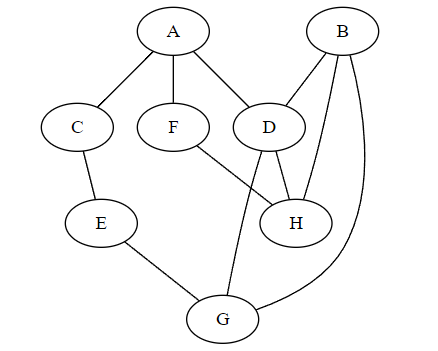
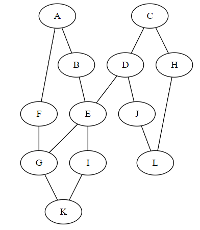

Exercices d'approfondissement
==============================

Exercice 1
-----------

On donne le graphe représenté par la figure suivante:

#.  Donner le parcours en profondeur du graphe en partant du sommet ``A`` par exemple.
#.  Donner le parcours en largeur du graphe en partant du sommet ``A``.
#.  Donner la liste d'adjacence de ce graphe. On pourra étiqueter les sommets dans l'ordre alphabétique en partant de 0.
#.  Donner le dictionnaire d'adjacence du graphe G.
#.  Verifier vos différentes réponses en utilisant les fonctions écrites en Python.

Exercice 2
-----------

On donne le graphe représenté par la figure suivante:

#.  Donner le parcours en profondeur du graphe en partant du sommet ``A`` par exemple.
#.  Donner le parcours en largeur du graphe en partant du sommet ``A``.
#.  Donner le parcours en largeur du graphe en partant du sommet ``E``.
#.  Donner la liste d'adjacence de ce graphe. On pourra étiqueter les sommets dans l'ordre alphabétique en partant de 0.
#.  Donner le dictionnaire d'adjacence du graphe G.
#.  Verifier vos différentes réponses en utilisant les fonctions écrites en Python.

