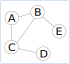

TP : Parcourir un graphe
=========================

.. note::

    Ce TP peut se faire dans un éditeur Python comme Thonny mais il faudra vous assurer d'avoir les modules créés cette année pour créer un **graphe**, une **pile** et une **file**.

    Un notebook est disponible sur Capytale et comprend les différents modules nécessaires à ce TP.

Parcours en profondeur
-----------------------

On donne ci-dessous un graphe :math:`G`:

Le parcours en profondeur consiste à parcourir les sommets reliés d'un graphe. Les sommets du graphe ont plusieurs sommets adjacents ce qui implique un choix de sommet à parcourir fait par l'algorithme. Les sommets adjacents ignorés sont alors placés dans une pile. Les sommets visités sont mémorisés dans une liste pour ne pas y retourner. Lorsqu'on arrive sur un sommet sans sommet adjacent ou déjà visité, on continue le parcours avec les sommets placés dans la pile.

Lorsque la pile est vide, la liste des sommets visités donne le **parcours en profondeur** du graphe.

On donne ci-après l'algorithme du parcours en profondeur d'un graphe.

.. admonition:: Algorithme
    :class: code

    .. code:: text

        G désigne un graphe
        S désigne un sommet du graphe

        sommets visités = []
        P est la pile des sommets à visiter (vide au départ)
        On empile le sommet de départ S dans P

        Tant que la pile P n'est pas vide:
            On dépile un sommet S à visiter
            Si S n'est pas un sommet visité:
                on l'ajoute à la liste des sommets visités
                Pour chacun des sommets adjacents à ce sommet S
                    on les empile dans la pile P

        On renvoie la liste des sommets visités

#.  Donner un parcours en profondeur possible du graphe ``G`` en partant du sommet ``A``.
    Donner les différents états de la pile ``P`` et de la liste ``sommets_visités`` à chaque itération de la boucle.
#.  Écrire en Python la fonction ``parcours_profondeur`` qui reprend l'algorithme ci-dessus. La fonction prend en paramètre un graphe défini par ses sommets adjacents et un sommet de départ du parcours. 

    La fonction renvoie la liste des sommets visités qui est un parcours en profondeur du graphe passé en paramètre.

#.  On donne un graphe défini par son dictionnaire d'adjacence :

    .. code-block:: python

        {
        'A' : ['B','C'],\
        'B' : ['D','E'],\
        'C' : ['F'],\
        'D' : ['B','E'],\
        'E' : ['B','D'],\
        'F' : ['C']
        }

    Déterminer avec la fonction python un parcours en profondeur du graphe en partant du sommet **A**.

Parcours en largeur
--------------------

Le **parcours en largeur** d'un graphe a pour but de donner le plus court chemin entre deux sommets du graphe s'il existe.

On se donne un sommet de départ puis on détermine tous les sommets distants de 1, puis tous les sommets distants de 2, etc, jusqu’à avoir visité tous les sommets du graphe relié au sommet de départ.

On peut utiliser un dictionnaire pour mémoriser tous les sommets et les distances les séparant du sommet de départ. Le sommet de départ a une distance de 0.

On donne ci-après l'algorithme de parcours en largeur d'un graphe:

.. admonition:: Algorithme
    :class: code

        .. code:: text
            
            VARIABLES:
            --------------------------------------------------------------------
            G désigne le graphe
            S désigne un sommet du graphe
            V désigne un sommet adjacent à S

            distances est un dictionnaire qui contient les sommets et les distances au départ
            courant est une liste qui contient les sommets à visiter
            suivant est une liste qui contient des sommets adjacents non visités
            --------------------------------------------------------------------
            distances = {S:0}
            courant contient le sommet de départ
            suivant est vide

            Tant que courant n'est pas vide:
                on prend un sommet S dans la liste suivant
                    Pour chaque sommet V adjacent à S:
                        si V n'est pas dans le dictionnaire distances:
                            on l'ajoute à la liste suivant
                            on l'ajoute au dictionnaire avec la distance de S augmentée de 1
                        si la liste courant est vide:
                            courant récupère les valeurs de la liste suivant
                            on vide suivant.
            
            On renvoie le dictionnaire distances

#.  Quel est le dictionnaire des distances au sommet ``A`` du graphe ``G`` ? Quel est ce dictionnaire si le départ est le sommet ``E`` ?
#.  On parcourt en largeur le graphe ``G`` en partant de ``A``.

    Donner les différents états des variables ``S``, ``V``, ``courant``, ``suivant`` et ``distances`` à chaque itération de la boucle **tant que**. On pourra présenter les valeurs dans un tableau comme ci-dessous.

    .. table::
        :class: bordure border-style-solid border-width-1 border-color-gray

        +---------+-----+-----+---+
        |variables|init.|1    |...|
        +---------+-----+-----+---+
        |courant  |[A]  |[]   |...|
        +---------+-----+-----+---+
        |suivant  |[]   |[B,C]|...|
        +---------+-----+-----+---+
        |S        |     |A    |...|
        +---------+-----+-----+---+
        |V        |     |B,C  |...|
        +---------+-----+-----+---+
        |distances|A:0  |B:1, |...|
        |         |     |C:1  |   |
        +---------+-----+-----+---+

#.  La fonction Python ``parcours_largeur`` prend en paramètre un graphe et un sommet de départ du graphe et renvoie le dictionnaire contenant les sommets du graphe reliés au sommet de départ avec chaque distance.

    Écrire le code de cette fonction en suivant l'algorithme ci-dessus.

#.  On donne un graphe défini par son dictionnaire d'adjacence :

    .. code-block:: python

        {
        'A' : ['B','C'],\
        'B' : ['D','E'],\
        'C' : ['F'],\
        'D' : ['B','E'],\
        'E' : ['B','D'],\
        'F' : ['C']
        }

    Déterminer avec la fonction python un parcours en largeur du graphe en partant du sommet **A**. 